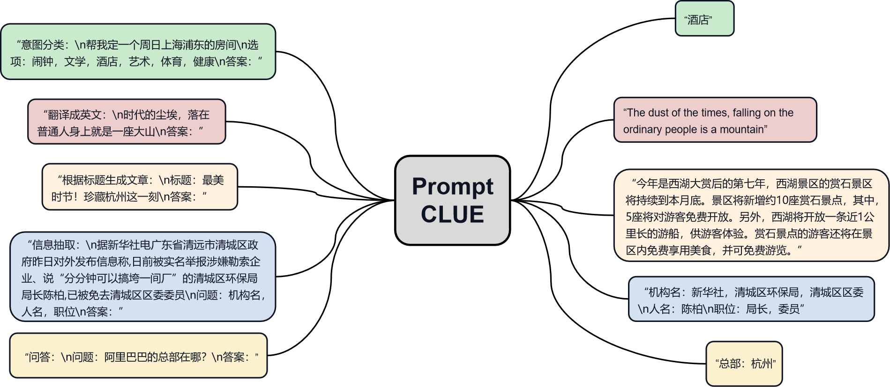
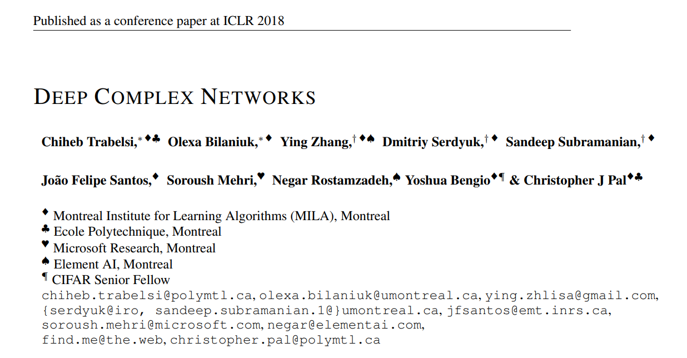
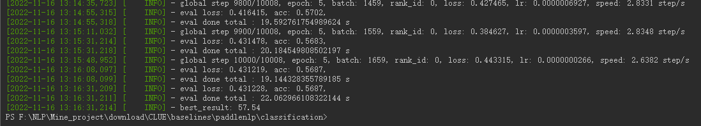
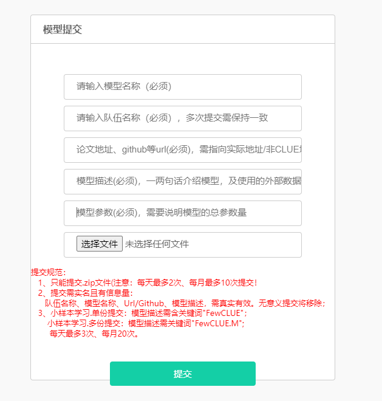

## NLP相关框架

**PyTorch Lightning**

**GluoNLP**

Gluonnlp在一些处理更方便，但缺乏灵活，功能更少

### [AllenNLP](https://guide.allennlp.org/common-architectures#2)

AllenNLP是艾伦人工智能研究院开发的开源NLP平台。软件设计优秀，面对对象思想，值得阅读源码

入门学习：

1. [AllenNLP使用教程](https://www.jianshu.com/p/17abfefc1b5b)
2. [学习AllenNLP专栏目录](https://zhuanlan.zhihu.com/p/102324519)

文本处理过程学习：

1. language to features

2. Tokenizers and TextFields

3. TokenIndexers

4. TextFieldEmbedders

5. Coordinating the three parts

6. pretrained contextualizers and embeddings

7. word-level modeling with a wordpiece transformer

8. padding and masking

9. Interacting with TextField outputs in your model code

   

#### 读取数据

`Field`

```python
from collections import Counter, defaultdict
from typing import Dict

from allennlp.data.fields import TextField, LabelField, SequenceLabelField
from allennlp.data.token_indexers import TokenIndexer, SingleIdTokenIndexer
from allennlp.data.tokenizers import Token
from allennlp.data.vocabulary import Vocabulary
```

```python
@DatasetReader.register('classification-tsv')
class ClassificationTsvReader(DatasetReader):
    def __init__(self):
        self.tokenizer = SpacyTokenizer()
        self.token_indexers = {'tokens': SingleIdTokenIndexer()}
        
    def text_to_instance(self, text: str, label: str = None) -> Instance:
        tokens = self.tokenizer.tokenize(text)
        text_field = TextField(tokens, self.token_indexers)
        fields = {'text': text_field}
        if label:
            fields['label'] = LabelField(label)
        
    def _read(self, file_path: str) -> Iterable[Instance]:
        with open(file_path, 'r') as lines:
            for line in lines:
                text, label = line.strip().split('\t')
                text_field = TextField(self.tokenizer.tokenize(text),
                                       self.token_indexers)
                label_field = LabelField(label)
                fields = {'text': text_field, 'label': label_field}
                yield Instance(fields)
```


#### 加载模型

```python
from allennlp.models import Model
```

```python
@Model.register('simple_classifier')
class SimpleClassifier(Model):
    def forward(self,
                text: Dict[str, torch.Tensor],
                label: torch.Tensor = None) -> Dict[str, torch.Tensor]:
        # Shape: (batch_size, num_tokens, embedding_dim)
        embedded_text = self.embedder(text)
        # Shape: (batch_size, num_tokens)
        mask = util.get_text_field_mask(text)
        # Shape: (batch_size, encoding_dim)
        encoded_text = self.encoder(embedded_text, mask)
        # Shape: (batch_size, num_labels)
        logits = self.classifier(encoded_text)
        # Shape: (batch_size, num_labels)
        probs = torch.nn.functional.softmax(logits)
        output = {'probs': probs}
        if label is not None:
            self.accuracy(logits, label)
            # Shape: (1,)
            output['loss'] = torch.nn.functional.cross_entropy(logits, label)
        return output
```

注：Model 是 torch.nn.Module 的一个子类，forward() 输出是字典

预测过程

```python
@Predictor.register("sentence_classifier")
class SentenceClassifierPredictor(Predictor):
    def predict(self, sentence: str) -> JsonDict:
        # This method is implemented in the base class.
        return self.predict_json({"sentence": sentence})

    def _json_to_instance(self, json_dict: JsonDict) -> Instance:
        sentence = json_dict["sentence"]
        return self._dataset_reader.text_to_instance(sentence)
```


损失函数

查看模型预测结果 (评估标准) 

保存和读取模型

正则化

---

#### 公共结构

Summarizing sequences

`seq2vec`

```python
from allennlp.modules.seq2vec_encoders import (
	Seq2VecEncoder,
    CnnEncoder,
    LstmSeq2VecEncoder,
)
```

Contextualizing sequences

`seq2seq`

```python
from allennlp.modules.seq2seq_encoders import (
	Seq2SeqEncoder,
    PassThroughEncoder,
    LstmSeq2SeqEncoder,
)
```


思考：为什么使用 LstmSeq2VecEncoder 而不是 torch.nn.LSTM ?

> The reasons you might want to use a `Seq2SeqEncoder` instead are three-fold: 
>
> first, it encourages you to think at a higher level about what basic operations your model is doing (am I contextualizing, summarizing, or both?). 
>
> Second, using [dependency injection](https://guide.allennlp.org/using-config-files#1) allows you to do controlled experiments easier, if you think you might one day want to try a different contextualizer in your model. Using an abstraction that encapsulates the options you want to experiment with is a powerful way to get very easy, controlled experiments. 
>
> Lastly, having a collection of models available that are written using higher-level abstractions lets component designers easily test their developments on a wide range of models.

#### 文本表示

将词语转成向量的几种方法 （非上下文、上下文Contextual）

* GloVe or word2vec embeddings
* Character CNNs
* POS tag embeddings
* Combination of GloVe and character CNNs
* wordpieces and BERT

**Three steps** (tokenize, index, embedding) in converting language to features

Text -> Tokens -> Ids -> Vectors

具体地

1. Tokenizer (Text -> Tokens)
2. TextField, TokenIndexer and Vocabulary (Tokens -> Ids)
3. TextFieldEmbedder (Ids -> Vectors)

Tokenizers

* Characters ("AllenNLP is great" → `["A", "l", "l", "e", "n", "N", "L", "P", " ", "i", "s", " ", "g", "r", "e", "a", "t"]`)
* Wordpieces ("AllenNLP is great" → `["Allen", "##NL", "##P", "is", "great"]`)
* Words ("AllenNLP is great" → `["AllenNLP", "is", "great"]`)

note: Wordpieces are similar to words, but further split words into `subword units`.

常用的分词器：`SpacyTokenizer`, `PretrainedTransformerTokenizer`, `CharacterTokenizer`

* character
* wordpiece
* word

```python
tokenizer = ...
sentence = "We are learning about TextFields"
tokens = tokenizer.tokenize(sentence)
token_indexers = {...}
text_field = TextField(tokens, token_indexers)
...
instance = Instance({"sentence": text_field, ...})
```


#### **模型训练**

```cmd
allennlp train \
    my_text_classifier.jsonnet \
    --serialization-dir model-bert \
    --include-package my_text_classifier
```

train后面的参数指定了用哪个配置文件，-s后面的目录指定了训练日志、字典、模型等的存放位置，`--include-package`后面的参数指定了我们前面编写的python代码在哪里

train 参数

* -f  强制重写输出目录
* --dry-run 加载数据不训练


#### 模型预测

```cmd
python -m allennlp.service.server_simple \
    --archive-path /path/for/model/and/log/model.tar.gz \
    --predictor text_classifier \
    --include-package AllenFrame.classification_code \
    --title "classification" \
    --field-name sentence
```


conda update -n base conda


#### Trick

* 多GPU

* [使用Optuna进行超参数优化](https://medium.com/optuna/hyperparameter-optimization-for-allennlp-using-optuna-54b4bfecd78b)

[使用少量内存训练大批次](https://blog.allenai.org/tutorial-training-on-larger-batches-with-less-memory-in-allennlp-1cd2047d92ad)

1. 梯度累计 num_gradient_accumulation_steps
2. 梯度检查点 gradient_checkpointing=True
3. 自动混合精度 use_amp

#### Jsonnet

[tutorial](https://jsonnet.org/learning/tutorial.html)

### EasyNLP

阿里NLP团队

[CLUE_baseline](https://github.com/alibaba/EasyNLP/tree/master/benchmarks/clue)

### PaddleNLP

百度NLP团队

pipelines 可以部署成Service


## 方法流程

### 方法

提示学习、EDA数据增强、对比学习RDrop、集成学习、Grid Search

### 流程

阶段一：领域预训练

阶段二：提示学习

挑选与任务适配的最优提示词，使用AutoPrompt框架

阶段三：数据增强 & 集成学习

数据策略和模型策略，采用多种数据增强策略，自动扩充标注数据，最终模型的结果采用多个模型的输出结果集成得到


**领域预训练**

百度NLP预训练语言模型文心ERNIE1.0-Large-CW


## 数据集

[GLUE](https://huggingface.co/datasets/severo/glue)

CLUE（Chinese Language Understanding Evaluation）：中文语言理解权威测评榜单

FewCLUE：中文小样本学习测评子榜


## 研究方向

### 预训练模型

* Transformer：多头自注意力机制
* 预训练 + 微调

| Model | Name | Size|
| :--: | :--: | :--: |
| BERT | Bert-uncased-large | xxxM |
| RoBERTa | roberta-wwm-ex |  |
| ERNIE | ERNIE-3.0 |  |
| QPFE-ERNIE | Quantum-inspred model, ERNIE | |
| ComplexQuantumModel | ComplexNN, Quantum-inspired, Pretraining | |

### 方法

| Method | Description | State |
| :--: | :--: | :--: |
| 预训练 | pretrain model with wiki or other corpus | √ |
| 微调 | fine-tune the pretrained model on downstream tasks | √ |
| 集成学习 | Boosting, Bagging |   √   |
| 提示学习 | prompt learning | × |
| 蒸馏 | distillation | √ |
| 数据增强 | EDA, data tricks | √ |



| 量子NLP      | works                                      |
| ------------ | ------------------------------------------ |
| 量子启发式   |                                            |
|              | Complex Embedding: NNQLM, CE-Mix, CNM, QWN |
|              | Complex-valued encoding: ComplexNN         |
| 量子机器学习 |                                            |
|              | 参数化量子线路学习：华为MindQuantum        |
| 近世代数     | DisCoCat, lambeq (Cambridge)               |

1. 华为参数化量子线路学习
2. lambeq，剑桥，文本到string，string到量子线路，参数化线路学习

### 任务

[GLUE](https://gluebenchmark.com/tasks)：英文语言模型评估

[CLUE](https://www.cluebenchmarks.com/)：中文语言模型评估

[SuperGLUE](https://super.gluebenchmark.com/leaderboard)

#### GLUE

| Sentence | TASK  | Description            | Metrics                       |
| -------- | :---: | ---------------------- | ----------------------------- |
| 单句     | COLA  | 分类任务，是否合乎语法 | Matthews corr.                |
|          | SST-2 | 情感分类               | acc.                          |
| 句子对   | MRPC  | paraphrase             | acc. / F1                     |
|          | STS-B | 句子相似度             | Pearson / Spearman corr.      |
|          |  QQP  | paraphrase             | acc. / F1                     |
|          | MNLI  | NLI                    | mathed acc. / mismatched acc. |
|          | QNLI  | QA/NLI                 | acc.                          |
|          |  RTE  | NLI                    | acc.                          |
|          | WNLI  | coreference/NLI        | acc.                          |

#### CLUE

| 任务        | 描述             | 评估指标 |
| ----------- | ---------------- | -------- |
| AFQMC       | 语义相似度       | acc.     |
| TNEWS       | 文本分类         | acc.     |
| IFLYTEK     | 长文本分类       | acc.     |
| CMNLI       | 自然语言推理     | acc.     |
| OCNLI       | 自然语言推理     | acc.     |
| CLUEWSC2020 | 代词消歧         | acc.     |
| CSL         | 论文关键词识别   | acc.     |
| CHID        | 成语阅读理解填空 | acc.     |
| $C^3$       | 中文多选阅读理解 | acc.     |
| CMRC2018    | 阅读理解         | EM/F1    |

 任务使用的评估指标均是 Accuracy。CMRC2018（阅读理解） 的评估指标是 EM (Exact Match)/F1，计算每个模型效果的平均值时，取 EM 为最终指标。

其中前 7 项属于分类任务，后面 3 项属于阅读理解任务

[Baseline](https://github.com/CLUEbenchmark/CLUE/tree/master/baselines/paddlenlp)

[Paddle处理FewCLUE](https://mp.weixin.qq.com/s/omHwSIIHqJsMzrYdurDOFg)


### My work

1. 量子启发式语言模型（预训练+微调）：基于复数值神经网络 & 预训练语言模型
2. 方法：Complex encode
   1. ComplexPyTorch
   2. ComplexLinear
   3. ComplexConv2d
   4. ComplexBatchNorm
3. 评估：
   1. sentiment classification
   2. GLUE + CLUE


模型构建

embedder: [batch_sz, seq_len] -> [batch_sz, seq_len, embedding_dim]

encoder: [batch_sz, seq_len, embedding_dim]

* complexcnn: 
* []


#### 实验结果（2022.11.28-...）

| model          |                                                           CR |                                                         MPQA |                                                           MR |                                                          SST |                                                         SUBJ |
| :------------- | -----------------------------------------------------------: | -----------------------------------------------------------: | -----------------------------------------------------------: | -----------------------------------------------------------: | -----------------------------------------------------------: |
| TextCNN        | acc: **78.8**<br/> prec: 70.2 <br/>recall: 72.3<br/> f1: 71.2<br>loss: 0.622 | acc: **74.4**<br/> prec: 72.4<br/>recall: 78.8<br/> f1: 75.5<br/> loss: 0.638 | acc: **75.0**<br/> prec: 73.2<br/> recall: 78.8<br/> f1: 75.9<br/> loss: 0.527 | acc: **81.4**<br/> prec: 81.5<br/> recall: 80.3<br/> f1: 80.9<br/> loss: 0.493 | acc: **90.3**<br/> prec: 92.0<br/> recall: 88.3<br/> f1: 90.1<br/> loss: 0.379 |
| ComplexTextCNN |                                                              |                                                       f1: 66 |                                                              | acc: **81.4**<br/> prec: 81.5<br/> recall: 80.3<br/> f1: 80.9<br/> loss: 0.493 |                                                              |
| GRU            |                                                              |                                                              |                                                              |                                                              |                                                              |
| ComplexGRU     |                                                              |                                                              |                                                              |                                                              |                                                              |
| ELMo           | acc: **85.4**<br/> prec: 80.0<br/> recall: 79.8<br/> f1: 79.9<br/> loss: 0.381 | acc: **90.5**<br/> prec: 88.2<br/> recall: 80.4<br/> f1: 84.1<br /> loss: 0.250 | acc: **81.0**<br /> prec: 77.0<br /> recall: 88.3<br /> f1: 82.3<br /> loss: 0.415 | acc: **88.8**<br /> prec: 89.3<br /> recall: 87.6<br /> f1: 88.4<br /> loss: 0.296 | acc: **94.9**<br /> prec: 95.6<br /> recall: 94.1<br /> f1: 94.9<br /> loss: 0.140 |
| BERT           | acc: **88.8**<br/> prec: 81.8<br/> recall: 88.0<br/> f1: 85.2<br/> loss: 0.289 | acc: **89.5**<br/> prec: 87.3<br/> recall: 77.9<br/> f1: 82.3<br/> loss: 0.362 | acc: **84.9**<br/> prec: 86.0<br/> recall: 83.3<br/> f1: 84.6<br/> loss: 0.360 | acc: **88.9**<br/> prec: 93.0<br/> recall: 83.6<br/> f1: 88.0<br/> loss: 0.298 | acc: **95.2**<br/> prec: 95.5<br/> recall: 94.9<br/> f1: 95.2<br/> loss: 0.142 |
| RoBERTa        | acc: **90.4**<br/> prec: 92.7<br/> recall: 79.8<br/> f1: 85.8<br/> loss: 0.265 | acc: **90.9**<br/> prec: 85.0<br/> recall: 86.1<br/> f1: 85.6<br/> loss: 0.257 | acc: **89.8**<br/> prec: 89.1<br/> recall: 90.7<br/> f1: 89.9<br/> loss: 0.304 | acc: **89.8**<br/> prec: 88.8<br/> recall: 90.7<br/> f1: 89.7<br/> loss: 0.238 | acc: **96.7**<br/> prec: 97.6<br/> recall: 95.8<br/> f1: 96.7<br/> loss: 0.098 |
| Complex-QNN    |                                                              |                                                              |                                                              |                                                              |                                                              |


一些细节：

Q: datasets processing

A: Allennlp pipeline.

Q: CR, MPQA, MR, SUBJ

A: 先读取所有数据，然后打乱，最后按7:3分割训练集和测试集

Q: version of BERT, RoBERTa

A: RoBERTa: `roberta-base`, BERT: `bert-base-cased`

Q: RoBERTa 训练出现精度无法提升的问题

A: 学习率不能调的太高，适合lr=1e-5


**complexPytorch**

[Deep Complex NetWorks](https://openreview.net/pdf?id=H1T2hmZAb)



ComplexNN 优势

* complex numbers could have a richer representational capacity and could also facilitate noise-robust memory retrieval mechanisms
* quantum

ComplexNN 组件

* Linear
* Conv2d
* ConvTranspose2d
* MaxPool2d
* AvgPool2d
* Activation: Relu (CRelu), Sigmoid, Tanh
* Dropout2d
* BatchNorm: BatchNorm1d, BatchNorm2d
* GRU / BN-GRU Cell
* convolutional LSTMs

结合方式

* Pretrained models (PTMs): 预训练语料库模型
* ComplexNN: 基于 complex feed-forward, complex convolutions and complex LSTMs 构建词嵌入层、演化层、测量层
* 双流：1）PTM-> 语义信息 2）ComplexNN -> 隐藏信息（real: , img: ）

实验

1. ComplexNN 
   1. ComplexTextCNN (Compare with TextCNN)
   2. ComplexGRU (Compare with TextGRU)
   3. Quantum-inspired Model (Complex Embedding + Projection + Evolution + Measurement)
2. PTMs (BERT, RoBERTa)
3. 双流（ComplexNN + PTMs）


| Task | Model          | Result |
| ---- | -------------- | ------ |
| SST2 |                |        |
|      | TextCNN        | 0.68   |
|      | ComplexTextCNN |        |
|      |                |        |


GLUE Results

|         | Score | CoLA     | SST-2    | MRPC          | STS-B         | QQP       | MNLI-m | MNLI-mm | QNLI     | RTE      | WNLI     | Diagnostics |
| ------- | ----- | -------- | -------- | ------------- | ------------- | --------- | ------ | ------- | -------- | -------- | -------- | :---------: |
| BERT    |       |          |          |               |               |           |        |         |          |          |          |             |
| RoBERTa |       |          |          |               |               |           |        |         |          |          |          |             |
| ERNIE   | 73.1  | **56.0** | 94.8     | **89.8/86.4** | 87.9/86.7     | 73.0/89.8 | 35.7   | 37.1    | 93.0     | 71.3     | 49.3     |     0.7     |
| Mine    | 74.2  | 55.2     | **95.3** | 88.6/84.8     | **88.7/87.6** | 73.1/89.8 | 36.0   | 36.9    | **93.1** | **72.3** | **59.6** |   **3.4**   |

CLUE Results

|                            Model                             | AVG       | AFQMC     | TNEWS | IFLYTEK | CMNLI     | OCNLI     | CLUEWSC2020 | CSL   | CMRC2018    | CHID      | C3        |
| :----------------------------------------------------------: | --------- | --------- | ----- | ------- | --------- | --------- | ----------- | ----- | ----------- | --------- | --------- |
|                      BERT-Base-Chinese                       | 72.57     | 74.63     | 57.13 | 61.29   | 80.97     | 75.22     | 81.91       | 81.90 | 65.30/86.53 | 82.01     | 65.38     |
|                     HFL/RoBERTa-wwm-ext                      | 74.11     | 74.60     | 58.08 | 61.23   | 81.11     | 76.92     | 88.49       | 80.77 | 68.39/88.50 | 83.43     | 68.03     |
| [ERNIE 3.0-Base-zh](https://bj.bcebos.com/paddlenlp/models/transformers/ernie_3.0/ernie_3.0_base_zh.pdparams) | **76.05** | **75.93** | 58.26 | 61.56   | **83.02** | **80.10** | 86.18       | 82.63 | 70.71/90.41 | **84.26** | **77.88** |
|                             Mine                             |           |           |       |         |           |           |             |       |             |           |           |

训练过程



提交结果

[submit](https://www.cluebenchmarks.com/submit.html)




## 思路
1. 改任务
   * GLUE (English)
   * CLUE (Chinese)
     * 毕业论文
2. 改模型
   * Quantum-inspired Model
   * Complex Neural Network
     * Complex Linear
     * Complex Convolution
     * Complex GRU
3. 量子机器学习-分类
   * 量子线路学习 （参数化量子线路）
   * 量子叠加、量子纠缠
4. 量子NLP（剑桥）
   * Cambridge Quantum
   * DisCoCat
   * pytket
   * lambeq


### 基于思路1+2

Model

1. ERNIE-Gram
2. 集成学习、预训练、微调、提示学习、蒸馏、数据增强

经典NLP方法：
1. 数据预处理：将文本转换为id
2. 模型构建，预训练模型+分类器
3. 模型训练：热启动、AdamW优化器、交叉熵损失、准确率评估

量子启发式模型处理NLP下游任务

预处理过程：大小写、分词、去除停用词、转化词典id

模型处理过程：

1）词嵌入：将词典id转化为词向量

2）特征提取：基于神经网络中间层（CNN、RNN、DNN、Transformer）提取特征，通过激活函数（ReLU，tanh，sigmoid）提升模型的非线性表达能力，dropout降低过拟合

3）分类预测：linear + Softmax

4）反向传播更新模型参数：基于优化器（SGD，Adagrad，RMSProp，Adam）根据Loss值计算梯度，并更新参数

具体地，

1. Complex Embedding
   1. Amplitude + Phase
   2. Complex encoding
     Density Matrix
2. CNN or GRU / LSTM or Transformer
3. Linear + Softmax

任务

* GLUE
* CLUE

毕设内容：我们进行了大量实验去验证模型，其中包括英文（GLUE），中文（CLUE）


## 参考论文

量子NLP

[QNLP in Practice: Running Compositional Models of Meaning on a Quantum Computer](https://arxiv.org/pdf/2102.12846.pdf)

量子启发式

[Quantum-Inspired Complex-Valued Language Models for Aspect-Based Sentiment Classification](https://www.mdpi.com/1099-4300/24/5/621)

复数值网络

[Deep Complex Networks (ICLR, 2018)](https://openreview.net/forum?id=H1T2hmZAb)


**CNN**

convolution2d layer:

根据**输入、卷积核、步长（stride）、填充（padding）、空洞大小（dilations）**计算输出特征层大小，输入和输出是NCHW or NHWC，其中 N 是 batch_size，C 是通道数，H 是特征高度，W 是特征宽度。卷积核是 MCHW 格式，M 是输出图像通道数，C 是输入图像通道数，H 是卷积核高度，W 是卷积核宽度。


## API

torch.Tensor.abs() 复数值取模长($\sqrt{a^2+b^2}$)