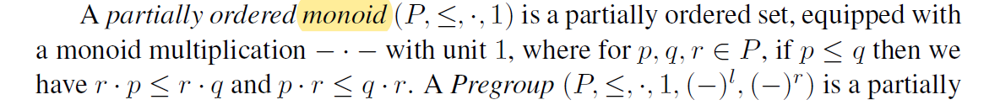
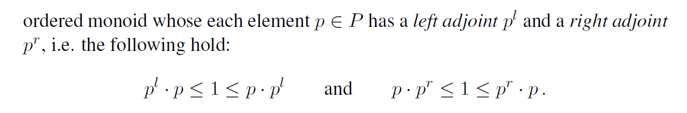

论文链接
[Mathematical Foundations for a Compositional Distributional Model of Meaning](https://arxiv.org/abs/1003.4394)

## 数学基础

`预群代数 `(the algebra of Pregroups): Lambek

> 群：G为集合，G上有二元运算$\times: G \times G \to G$, 满足：结合律，存在单位元，存在逆元。

`布饶尔群` (Brauer group)：亦称代数类群，域F上有限中心单代数的相似代数类所构成的群。

`中心单代数`：亦称正规单代数，若域F上代数A的中心是F本身，则称A为中心代数，中心是F的F单代数称为中心单代数。

`部分序幺半群`

n: noun

s: declarative statement, 陈述句

j: infinitive of the verb，动词不定式

$\sigma$: glueing type，粘合类型

## lambeq

Lambeq是第一个用于量子自然语言处理的软件库，用于将短语转换为量子电路。量子计算社区已经使Lambeq开源，以造福全球社区，它正在迅速发展一个由开发者、学者、研究人员和用户组成的生态系统。QNLP库Lambeq与剑桥量子公司的TKET兼容顺畅，TKET也是开源的，被广泛用作软件开发平台。由于这个好处，QNLP的开发人员可以尽可能多地使用量子计算机。将自然语言集成到量子电路中并不是一件容易的事。Lambeq的初始过程是处理和解析一个句子。在统计组合类别语法(CCG)解析器的帮助下，为选定的组合模型生成语法树。字符串图是由解析树形成的，作为下一个流程[8]。字符串图以更详细的方式显示句子的语法结构。为了将这个字符串图作为语法结构存储和操作，QNLP库lambeq使用一个名为DisCoPy的python库作为后端数据库。这是基于在A节中讨论的DisCoCat模型。应用程序将重写规则用于这些字符串图的转换。应用于这些弦图的转换然后转换为实际的量子电路。通过剑桥量子计算机的TKET的输出可以引导到量子模拟器或量子计算机，而在经典情况下，用于优化的网络(张量网络)可以传递到ML库，如Jax或Pytorch。

### 处理过程

1) Parsing

2) DisCoCat implementation

* Creation of DisCoCat Diagram

  创建DisCoCat图:将DisCoCat图的生成可视化的一种简单方法是将每个单词表示为一种状态，然后用表示每个约简规则的连线将它们连接起来(表示两个表达式之间的语义等价)。

* Rewriting

  重写:在这个子步骤中，使用DisCoCat图作为参考，以获得可能的约简

  在句子中。图的转换，如上图所示，使结构更紧凑，并提供计算优势。这里解释的重写是bigraph方法的简化版本。

* Ansatz

  Ansatz: 这是DisCoCat模型的最后一步，前面步骤创建的句子的DisCoCat表示被转换为量子电路。这种转换通过以下方式映射DisCoCat图来完成——(i)选择qn和qs作为每根类型为n和s的导线及其对偶类型要映射到的量子位的数量，(ii)为要替换的字态选择具体的参数化量子态。因此，Ansatz的选择决定了每个单词表示的参数数量，而电路的连通性则由语法的结构确定。

3) Quantum circuit interpretation

​		量子电路解释：这是最后一步，根据系统中可用的门，量子电路被转换为一系列数学运算，然后这些运算在量子硬件上执行。为此，量子电路首先由量子编译器翻译成机器指令;这是通过考虑电路的数学解释以及作为硬件的可用门集和系统的拓扑结构来实现的。这些特定于机器的指令随后被传递到量子计算机上执行量子电路多次。这个过程的最后一步是得到相对频率的估计，以确定最终结果。这一步骤的详细说明超出了本文的范围。

### DisCocat

DisCoCat grammar model

- expresses both the meaning of words (distributional) and how words interact (compositional) to form a sentencec, and is based on a **category-theoretic** model
- Incorporate the grammatical and linguistic structure of sentences

参考：

[Categories for the Practising Physicist](https://link.springer.com/chapter/10.1007/978-3-642-12821-9_3)

* categories theory