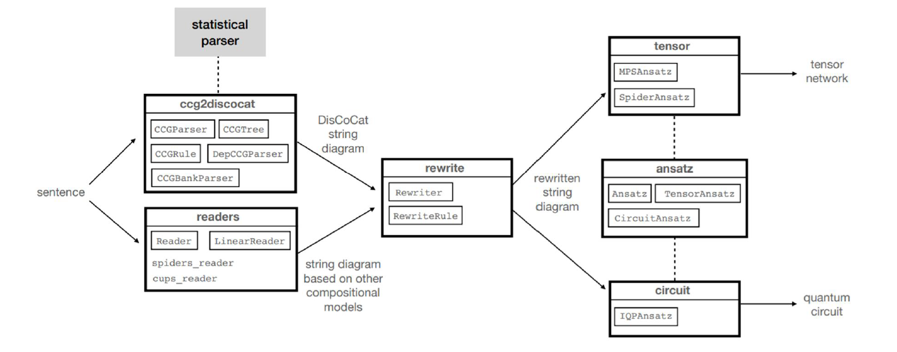
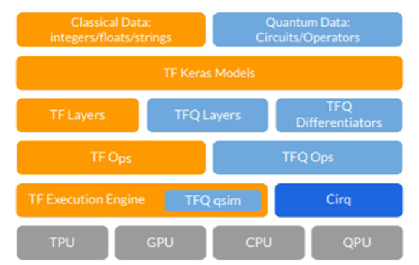

## 量子计算
Nielsen, M. A. & Chuang, I. L. Quantum computation and quantum information. (2010).

Biamonte, J. et al. Quantum machine learning. Nature 549, 195–202 (2017).

* QPCA
* QSVM
* HHL
* 量子退火
* 量子玻尔兹曼机

[Benedetti, M., Lloyd, E., Sack, S. & Fiorentini, M. Parameterized quantum circuits as machine learning models. Quantum Sci. Technol. 4, 043001 (2019).](https://iopscience.iop.org/article/10.1088/2058-9565/ab4eb5)

* PQC
* VQE: Hamiltonian
* QAOA: MaxCut

## 量子计算机

物理实现方式：囚禁离子阱、超导、核磁共振、光量子

### 超导

超导量子电路的基本元器件包括**电容、电感、约瑟夫森结**，其中电容和电感为线性器件，约瑟夫森结提供非线性。约瑟夫森结通常由两个超导层间隔一层绝缘层实现，只要中间的绝缘层足够薄，两侧超导体的库伯对之间仍然存在相互作用。

## 量子计算云平台

[量桨](https://qml.baidu.com/tutorials/overview.html)

[1] Wang, Youle, Guangxi Li, and Xin Wang. "Variational quantum Gibbs state preparation with a truncated Taylor series." Physical Review Applied 16.5 (2021): 054035. [[pdf](https://arxiv.org/pdf/2005.08797.pdf)]

* Gibbs 制备

[2] Wang, Xin, Zhixin Song, and Youle Wang. "Variational quantum singular value decomposition." Quantum 5 (2021): 483. [[pdf](https://arxiv.org/pdf/2006.02336.pdf)]

* 变分奇异值分解

[3] Li, Guangxi, Zhixin Song, and Xin Wang. "VSQL: Variational Shadow Quantum Learning for Classification." Proceedings of the AAAI Conference on Artificial Intelligence. Vol. 35. No. 9. 2021. [[pdf\]](https://arxiv.org/pdf/2012.08288.pdf)

* 分类

[4] Chen, Ranyiliu, et al. "Variational quantum algorithms for trace distance and fidelity estimation." Quantum Science and Technology (2021). [[pdf\]](https://arxiv.org/pdf/2012.05768.pdf)

* trace distance & 保真度估计

[5] Wang, Kun, et al. "Detecting and quantifying entanglement on near-term quantum devices." arXiv preprint arXiv:2012.14311 (2020). [[pdf\]](https://arxiv.org/pdf/2012.14311.pdf)

* 纠缠

[6] Zhao, Xuanqiang, et al. "Practical distributed quantum information processing with LOCCNet." npj Quantum Information 7.1 (2021): 1-7. [[pdf\]](https://arxiv.org/pdf/2101.12190.pdf)

* 量子信息处理

[7] Cao, Chenfeng, and Xin Wang. "Noise-Assisted Quantum Autoencoder." Physical Review Applied 15.5 (2021): 054012. [[pdf\]](https://journals.aps.org/prapplied/abstract/10.1103/PhysRevApplied.15.054012)

* 量子编码器

[昇思Mindspore](https://www.mindspore.cn/mindquantum/docs/zh-CN/master/index.html)

## QNLP

`lambeq `

Lambeq是第一个用于量子自然语言处理的软件库，用于将短语转换为量子电路。量子计算社区已经使Lambeq开源，以造福全球社区，它正在迅速发展一个由开发者、学者、研究人员和用户组成的生态系统。QNLP库Lambeq与剑桥量子公司的TKET兼容顺畅，TKET也是开源的，被广泛用作软件开发平台。由于这个好处，QNLP的开发人员可以尽可能多地使用量子计算机。将自然语言集成到量子电路中并不是一件容易的事。Lambeq的初始过程是处理和解析一个句子。在统计组合类别语法(CCG)解析器的帮助下，为选定的组合模型生成语法树。字符串图是由解析树形成的，作为下一个流程[8]。字符串图以更详细的方式显示句子的语法结构。为了将这个字符串图作为语法结构存储和操作，QNLP库lambeq使用一个名为DisCoPy的python库作为后端数据库。这是基于在A节中讨论的DisCoCat模型。应用程序将重写规则用于这些字符串图的转换。应用于这些弦图的转换然后转换为实际的量子电路。通过剑桥量子计算机的TKET的输出可以引导到量子模拟器或量子计算机，而在经典情况下，用于优化的网络(张量网络)可以传递到ML库，如Jax或Pytorch。

1) Parsing

2) DisCoCat implementation

* Creation of DisCoCat Diagram

  创建DisCoCat图:将DisCoCat图的生成可视化的一种简单方法是将每个单词表示为一种状态，然后用表示每个约简规则的连线将它们连接起来(表示两个表达式之间的语义等价)。

* Rewriting

  重写:在这个子步骤中，使用DisCoCat图作为参考，以获得可能的约简

  在句子中。图的转换，如上图所示，使结构更紧凑，并提供计算优势。这里解释的重写是bigraph方法的简化版本。

* Ansatz

  Ansatz:这是DisCoCat模型的最后一步，前面步骤创建的句子的DisCoCat表示被转换为量子电路。这种转换通过以下方式映射DisCoCat图来完成——(i)选择qn和qs作为每根类型为n和s的导线及其对偶类型要映射到的量子位的数量，(ii)为要替换的字态选择具体的参数化量子态。因此，Ansatz的选择决定了每个单词表示的参数数量，而电路的连通性则由语法的结构确定。

3) Quantum circuit interpretation

​		量子电路解释:这是最后一步，根据系统中可用的门，量子电路被转换为一系列数学运算，然后这些运算在量子硬件上执行。为此，量子电路首先由量子编译器翻译成机器指令;这是通过考虑电路的数学解释以及作为硬件的可用门集和系统的拓扑结构来实现的。这些特定于机器的指令随后被传递到量子计算机上执行量子电路多次。这个过程的最后一步是得到相对频率的估计，以确定最终结果。这一步骤的详细说明超出了本文的范围。

`Tensorflow Quantum`

另一个使用NISQ(噪声中间尺度量子)处理器的框架是Tensorflow Quantum (TFQ)。它是开源的，用于开发混合量子经典ML模型。它专注于量子数据，并集成了量子算法、张量流api和量子模拟器。引入了较新的算法，如QNN(量子神经网络)和PQM(参数化量子电路)。TFQ可以统一经典和量子ML基础结构，因为从根本上说电路是张量，使用Cirq结构我们可以生成这些张量。因此，我们可以无缝地将量子电路转换为与TensorFlow数据结构兼容的张量。TFQ的目标是连接两个领域:机器学习和量子计算。Cirq是一个框架，它使我们能够在短期设备的量子电路上工作&也有助于为NISQ机器制作算法。正如[9]中提到的，TFQ与Qsim结合，有时与GPU结合，在计算上比Cirq快得多。

## 相关文献

Quantum Generative Training Using Renyi Divergences

内容：

* a training algorithm that minimizeds the maximal Renyi divergence of order two
* thermal state learning and Hamiltonian learning

[Design and Implementation of a Quantum Kernel for Natural Language Processing](https://arxiv.org/abs/2205.06409)
内容
1. 使用lambeq处理NLP分类任务（科技、食物二分类）
2. 利用DisCoCat模型设计一种量子核函数
3. 两种相似度测量：transition amplitude approach and SWAP test 

意义：

1. 构造了一组17词、100句组成的简单数据级
2. 有[开源代码](https://github.com/mattwright99/thesis)

[Mathematical Foundations for a Compositional Distributional Model of Meaning](https://arxiv.org/abs/1003.4394)

内容

1. DisCoCat

## 量子应用

**量子机器学习QNN**

量子化学模拟VQE

量子优化算法QAOA

`施特恩－格拉赫实验`

## 我的工作

方向

1. 改任务
2. 改模型
3. 加量子线路

量子机器学习

